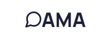

  

OAMA is a web application for instant and real time communication with no required login to chat with other users.

# Group

- Christian Bernasconi 816423
- Gabriele Ferrario 817518
- Riccardo Pozzi 807857
- Marco Ripamonti 806785

# Documentation

Documentation available [here](https://gitlab.com/unizzan/oama/-/wikis/home).
